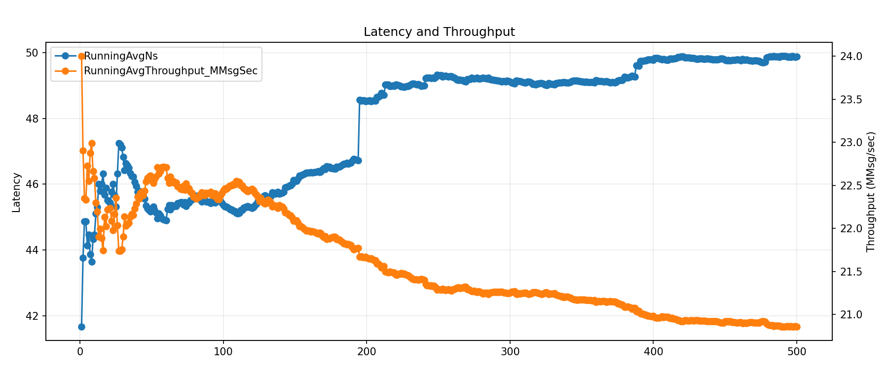
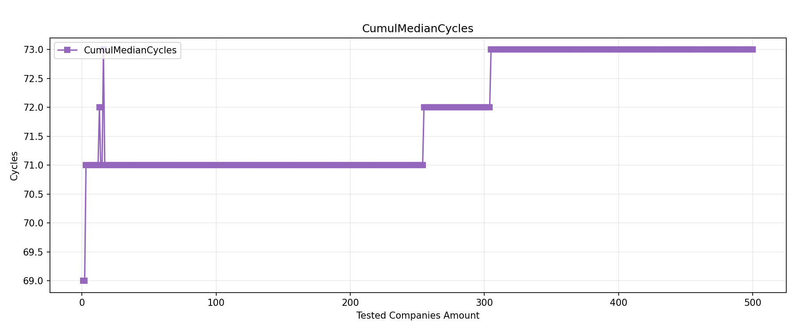
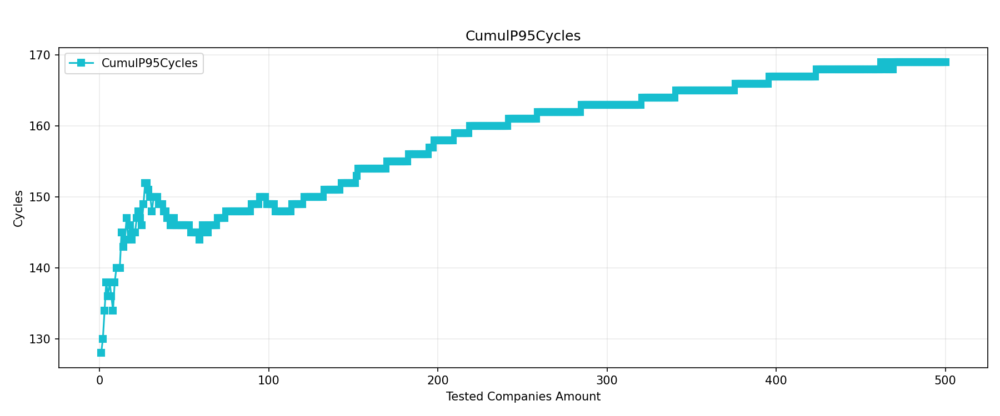
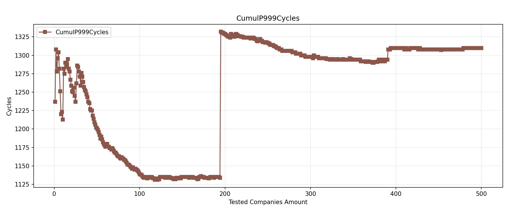
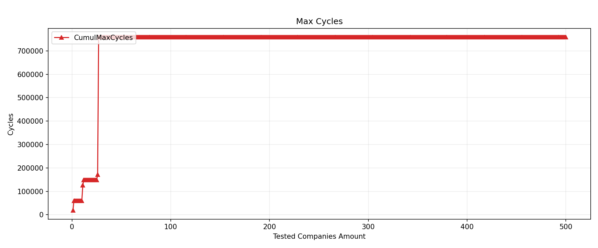

# High-Performance C++ L3 Limit Order Book Matching Engine

A memory-safe, ultra-low-latency Level 3 (L3) Limit Order Book matching engine written in C++20. Engineered with High-Frequency Trading (HFT) design patterns, this engine completely eliminates dynamic memory allocation on the critical execution path to achieve deterministic, nanosecond-scale trade matching.

## ⚙️ Core Architecture

The engine is built entirely around a **Zero-Allocation Array-Based Intrusive Doubly-Linked List**. 

Traditional order books rely on dynamic structures like `std::map` or `std::list`, which trigger frequent heap allocations (`new`/`delete`) and induce severe CPU cache fragmentation. This architecture bypasses the OS allocator entirely by pre-allocating contiguous memory pools at startup:

* **Flat Memory Pools:** All orders (`vector<Order> orders`) and price levels (`vector<PriceLevel> priceLevels`) reside in fixed-size, contiguous blocks of RAM initialized during boot.
* **Intrusive Layout:** Instead of raw or smart pointers, orders are chained together using standard integer indices (`prevOrderId`, `nextOrderId`) that point directly into the pre-allocated flat arrays.
* **O(1) Price Level Management:** Active price levels are tracked via dense `nextPrices` and `prevPrices` lookup arrays. This allows the matching loop to instantly skip empty price gaps, maintaining speed even during sparse market conditions.
* **O(1) Order Lifecycle Operations:** Order IDs map 1:1 with their internal array index. This enables instant $O(1)$ lookups, insertions, and cancellations. Because it is an intrusive doubly-linked list, unlinking a dead order or purging an empty price level is a pure $O(1)$ pointer/index swap, entirely avoiding list traversals.

## 📊 Performance & Benchmarks

Performance telemetry is captured directly via hardware CPU timestamp counters using the `__rdtsc()` intrinsic. 

Benchmarks are executed using real, historical market data parsed from raw **NASDAQ ITCH** feeds. To protect against compiler over-optimization (such as Dead Code Elimination), inline assembly barriers (`asm volatile` memory clobbers) are embedded directly within the timing loops. This forces the CPU to serialize memory operations and flush register states back to the L1 data cache before the clock stops, capturing a true, un-optimized representation of execution latency.

The ITCH data is sorted by ticker to minimize latency caused by fetching data from RAM.

## 📈 Benchmark Plots











> **Hardware Environment:** 12th Gen Intel(R) Core(TM) i5-1235U @ 2.50 GHz (High Performance Mode)
> **OS Platform:** Windows 11 (MSYS2/MinGW-W64)

## 🔬 Telemetry Observations

* **CPU Warm Up** The spike in average and P95 latencies when processing higher-volume asset classes (less than Company Rank 50) indicates that the CPU experiences a warm-up period.
* **Steady-State Determinism:** When the system is fully warmed up and the instruction cache is hot, the core matching logic achieves a remarkably flatlined median performance of **69-73 CPU cycles** per event.
* **Cache Topology Limits:** As the engine processes the lower-volume asset classes (approaching Company Rank 190+), minor L3 cache misses and branch predictor rhythm changes occur due to increased memory demands, introducing a step-up in cumulative P95 and P99.9 latencies.
* **Operating System Jitter:** The isolated spikes observed in the `Max Cycles` telemetry (~760,000 cycles) represent tail-risk anomalies introduced exclusively by OS background interrupts, page faults, and thread scheduler preemption rather than structural code inefficiencies.

## ✅ Algorithmic Correctness & Invariants

To guarantee that aggressive optimization flags (`-O3`, `-march=native`, `-flto`) do not alter the foundational mechanics or state machine of the matching engine, the system enforces strict invariant checking post-run. 

For every single ticker processed, the engine asserts that all remaining orders contain non-negative quantities, the final market spread remains valid ($\text{Best Ask} > \text{Best Bid}$), and volume conservation holds perfectly true via the following equation:

$$TotalRemaining + TotalCancelled + 2 \times TotalTraded = TotalInjected$$

These assertions prove exact, mathematically rigorous Price-Time Priority (FIFO) matching compliance across the entire dataset.

## 🛠️ Building and Running

This project requires a compiler fully compliant with the `C++20` standard. The benchmark can be compiled manually with native hardware targeting or via the provided automated `Makefile`.

```bash
# Compile with aggressive optimizations and native architecture targeting
g++ -std=c++20 -O3 -march=native -flto src/main.c++ -o engine_benchmark

# Run the benchmark
./engine_benchmark.exe
```

If you are using the provided `Makefile`, you can build with:

```bash
make
```

Then run:

```bash
./engine_benchmark.exe
```

### Windows / MSYS2

If you are on Windows with MSYS2 and `g++`, use the same compile command from the MSYS2 shell:

```bash
g++ -std=c++20 -O3 -march=native -flto src/main.c++ -o engine_benchmark.exe
./engine_benchmark.exe
```

### Notes

* Ensure the CSV and benchmark input files are located in the working directory when running the executable.
* The benchmark outputs a final correctness summary and cycle counts, which are used to generate `averagetimes.csv`.
* If you want to regenerate the plots, run the Python script from the repo root:

```bash
python src/plot_averagetimes.py
```

## 📖 Acknowledgements

* The NASDAQ ITCH data was downloaded from https://emi.nasdaq.com/ITCH/Nasdaq%20ITCH/
